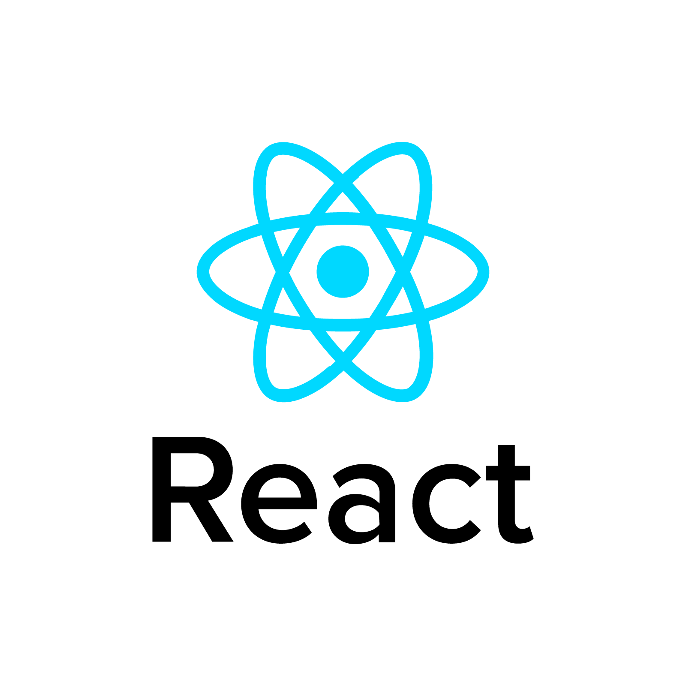

# Java Script Lecture 1

### Java Script is mainly used for animation,validation for makin web pages.Now java script is also using for mobile app development.

# JavaScript is also used in many other areas:
## Front-end-apps:
 ### ° React 1 
### ° A
### ° V
## Back-end-apps:
### 1. NOde js 

## THE ROLE OF JAVASCRIPT IN WEB DEVELOPMENT
#### *HTML-for the structure.
#### *CSS-for dessidning.
#### *JAVA-SCRIPT-for motion and annimation.

## The history of creation Java-Script
- Brenden Eich is the creator of Java-Script.
- The first version of Java-Script in 10 days.
- First name was Mocha but had all features of modern JS.

## JAVASCRIPT RELEASES!
#### ES-5 *2014:
#### ES-6 *2015: The biggest language update Ever. 
#### ES-7 *2016:
#### ES-8 *2017:
#### ES-9 *2018:
#### ES-10 *2019:
#### ES-11 *2020:

# JavaScript Variables and Constants
## 1 .VAR
###  * Var is used in older version of Java-Script.
## 2 .LET
### * Let is the new way using variables starting ES6.
## 3 .COCNST
### * Const  showes that the  value of a variable is a const

# -VALUE-
## 1.Object (Nonprimitive)
### * Objects
#### 1.Object literal 
#### 2.Arrays
#### 3.Functions

## 2.Primitive
### * Number.
### * String.
### * Boolean.
### * Undefined.
### * Null.
### * Symbol.
### * Biglnt.

# -OPERATORS-
### 1.Arithmetic - +,-,*,/
### 2.Comparison - ==,===,>=,<=,!=,!==
### 3.Logical - ||,&&,!
### 4.Type conversations - Number("3.14)
### 5.Assignment - =,+=,-=,*=,/=,^=,%=

# Three important topics
## 1.Conditions
## 2.Loops
## 3.Functions

### ^Condition Operarators
#### Condition ? True : False

## Function
### 1.Function-declaration
### 2.Function-expression -> 1.Arrow function 2.Anonumus.F
### 3.Immediately invoked function expression (IIFE)

#### * function_declaration:
function name (v,a){
return v * a;
}
console.log(name(value,value))
#### * function_expression:
let anonymous=function(parametr){
    return parametr
}
anonymus("hi")

let arrow =(parametr)=>{
    return parametr
}
console.log(arrow("hi"))

  

